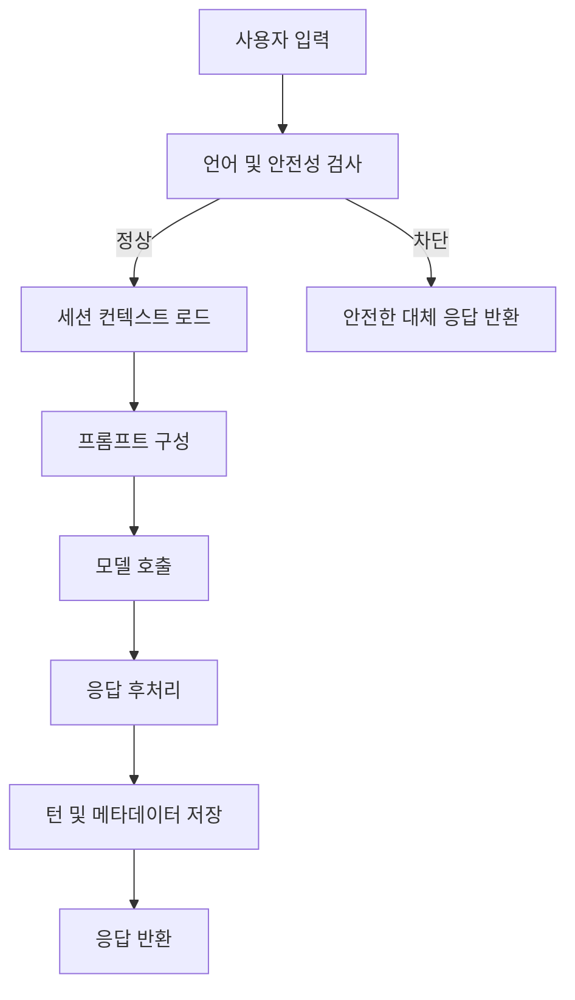

# 대화 턴 처리

## 목적
- 사용자 입력부터 최종 응답 반환까지의 엔드투엔드 흐름을 정의한다.

## 진입 조건
- 사용자가 메시지를 전송한다.
- 세션이 존재하고 최근 컨텍스트를 불러올 수 있다.

## 메인 플로우

## 예외 분기
- 컨텍스트 로드 실패 -> 최소 컨텍스트로 진행하고 경고 로그를 남긴다.
- 모델 타임아웃 -> 재시도 유도 메시지를 반환한다.

## 연결 노트
- 프로젝트: [[01_projects/001_malang/001_malang|001_malang]]
- 이슈: [[01_projects/001_malang/problems/001_realtime-issues|001_realtime-issues]]
