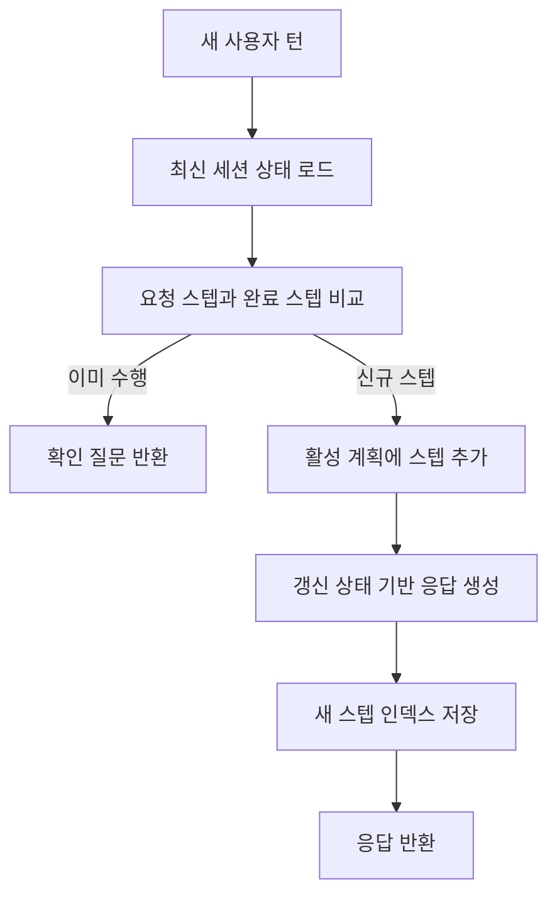

# 컨텍스트 갱신

## 목적
- 매 턴마다 세션 상태를 갱신/검증해 동일 스텝 반복을 방지한다.

## 진입 조건
- 새로운 사용자 턴이 도착한다.
- 이전 턴 요약과 스텝 인덱스를 조회할 수 있다.

## 메인 플로우

## 예외 분기
- 상태 버전 불일치 -> 최근 턴 기반으로 재구성하고 복구 이벤트를 기록한다.
- 스텝 인덱스 누락 -> 다음 액션 전 안전한 요약 응답으로 기본 처리한다.

## 연결 노트
- 프로젝트: [[01_projects/001_malang/001_malang|001_malang]]
- 이슈: [[01_projects/001_malang/problems/001_realtime-issues|001_realtime-issues]]
