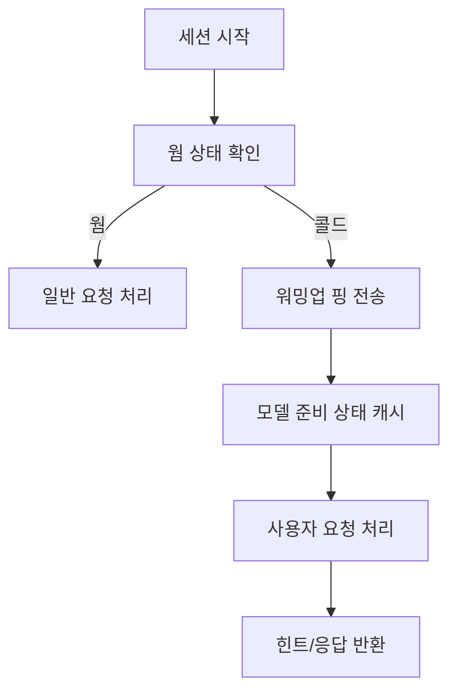

# 힌트 지연 개선

## 목적
- 콜드 세션에서 첫 유효 힌트/응답까지의 지연을 줄인다.

## 진입 조건
- 유휴 시간이 지난 뒤 세션이 시작된다.

## 메인 플로우

## 예외 분기
- 워밍업 실패 -> 즉시 본 요청을 처리하고 지연 메트릭을 기록한다.
- 캐시 사용 불가 -> 인메모리 웜 플래그로 대체한다.

## 연결 노트
- 프로젝트: [[01_projects/001_malang/001_malang|001_malang]]
- 이슈: [[01_projects/001_malang/problems/001_realtime-issues|001_realtime-issues]]
