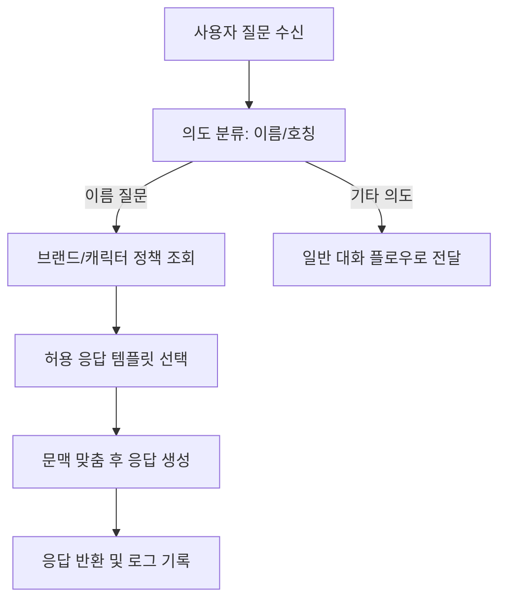

# 이름 질문 의도 처리

## 목적
- "이름이 뭐에요?" 질문에 제품 의도에 맞는 명확한 답변을 일관되게 반환한다.

## 진입 조건
- 사용자 입력에 이름/호칭 관련 의도가 포함된다.

## 메인 플로우

## 예외 분기
- 정책 조회 실패 -> 기본 안전 템플릿으로 응답한다.
- 의도 분류 불확실 -> 확인 질문 후 재분류한다.

## 연결 노트
- 프로젝트: [[01_projects/001_malang/001_malang|001_malang]]
- 이슈: [[01_projects/001_malang/problems/001_realtime-issues|001_realtime-issues]]
