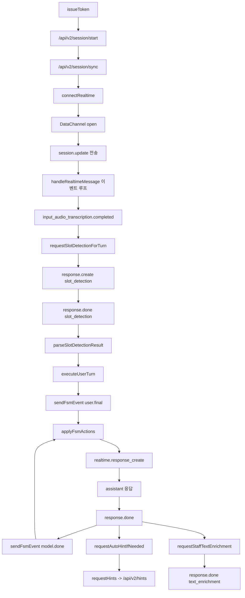
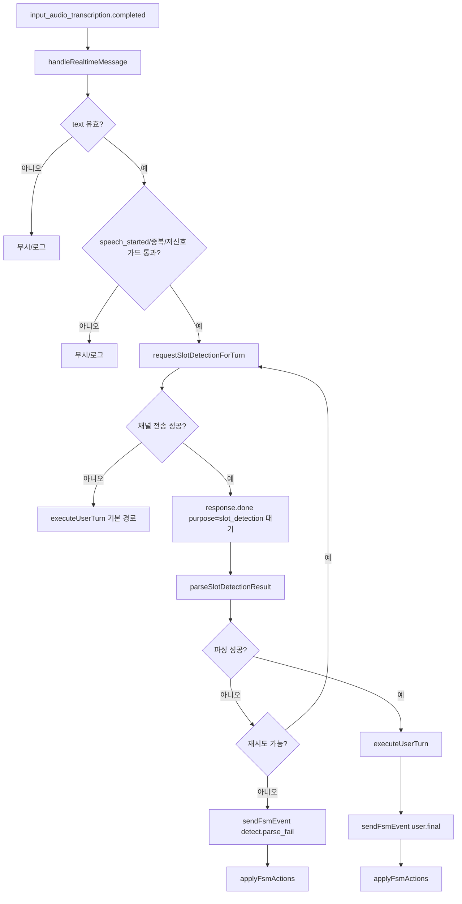
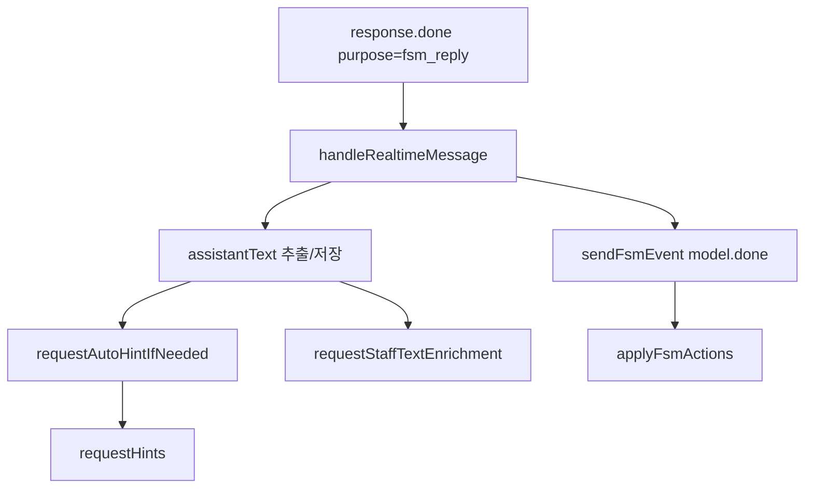
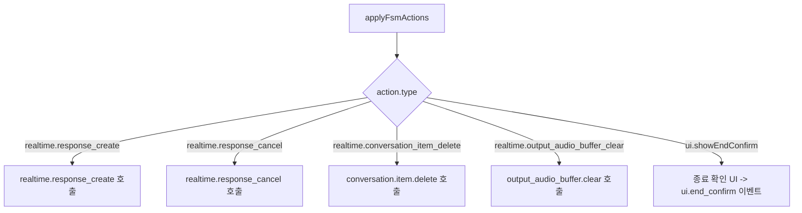
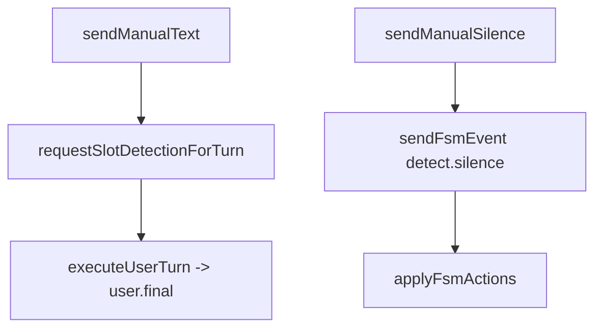

# 프론트 시나리오 테스트 함수 맵(v2)

- Canvas 보기: [[01_projects/001_malang/flows/30_feature-lanes/005_프론트 시나리오 테스트 함수 맵 v2.canvas|프론트 시나리오 테스트 함수 맵(v2) Canvas]]
- 세부 Canvas A: [[01_projects/001_malang/flows/30_feature-lanes/프론트 시나리오 테스트/A_사용자 발화.canvas|워크플로우 A 사용자 발화]]
- 세부 Canvas B: [[01_projects/001_malang/flows/30_feature-lanes/프론트 시나리오 테스트/B_모델 응답.canvas|워크플로우 B 모델 응답]]
- 세부 Canvas C: [[01_projects/001_malang/flows/30_feature-lanes/프론트 시나리오 테스트/C_FSM 액션.canvas|워크플로우 C FSM 액션]]
- 세부 Canvas D: [[01_projects/001_malang/flows/30_feature-lanes/프론트 시나리오 테스트/D_수동 테스트.canvas|워크플로우 D 수동 테스트]]
- 세부 Canvas E: [[01_projects/001_malang/flows/30_feature-lanes/프론트 시나리오 테스트/E_이벤트 분기 구조.canvas|워크플로우 E 이벤트 분기 구조]]
- 이벤트 분기 상세 문서: [[01_projects/001_malang/flows/40_specs/roleplay-test-v2-이벤트-분기-폴더-구조|roleplay-test-v2 이벤트 분기/폴더 구조]]

## 목적
- `roleplay-test-v2` 페이지에서 롤플레잉 테스트 흐름을 함수 단위로 빠르게 추적한다.
- 복잡한 구간(슬롯 판정, FSM 액션 반영, Realtime 이벤트 분기)을 우선 이해한다.

## 기준 코드
- Admin 테스트 페이지: `admin/app/(dashboard)/roleplay-test-v2/page.tsx`
- 모바일 실사용 훅(비교 참고): `app/hooks/roleplay/useRealtimeSession.ts`

## 메인 플로우(함수 중심)

## 함수 플로우 차트

### 1) 사용자 발화 -> 슬롯 판정 -> FSM 반영

### 2) 모델 응답 완료 후 후속 처리

### 3) 서버 액션 적용 분기(`applyFsmActions`)

### 4) 수동 테스트 진입점

## 함수별 역할(우선순위 순)
- `handleRealtimeMessage` (`page.tsx:1577`): Realtime 이벤트 라우터. 전사 완료/응답 완료/취소/삭제/가드 처리의 중심.
- `requestSlotDetectionForTurn` (`page.tsx:1419`): 사용자 발화를 슬롯 판정 요청으로 변환해 별도 `response.create` 실행.
- `parseSlotDetectionResult` (`page.tsx:546`): 슬롯 판정 JSON 파싱 및 정규화(언어/의도/offTopic/filled).
- `executeUserTurn` (`page.tsx:1380`): 최종 `user.final` 이벤트로 FSM에 사용자 턴 전달.
- `sendFsmEvent` (`page.tsx:1085`): `/api/v2/session/event` 호출 후 상태 재동기화.
- `applyFsmActions` (`page.tsx:1268`): 서버 액션을 클라이언트 동작(`response_create/cancel/item_delete/session_update`)으로 반영.
- `issueToken` (`page.tsx:2232`): 테스트 세션 초기화 + 세션 발급 + sync + 부트스트랩 액션 준비.
- `connectRealtime` (`page.tsx:2096`): WebRTC/SDP 연결, DataChannel 준비, `session.update` 반영.
- `requestHints` (`page.tsx:1141`): `lastAssistant` 중심 힌트 요청(`/api/v2/hints`).
- `requestAutoHintIfNeeded` (`page.tsx:1240`): 응답 중복 방지 후 자동 힌트 트리거.
- `sendManualText` (`page.tsx:2328`): 음성 없이 `user.final` 흐름 수동 검증.
- `sendManualSilence` (`page.tsx:2373`): `detect.silence(stage 1/2)`로 FSM 전이 수동 검증.

## 복잡 포인트(버그 집중 구간)
- 이벤트 분기 집중: `handleRealtimeMessage`에 상태 전이와 가드 로직이 밀집.
- 슬롯 판정 체인: 판정 요청 -> JSON 파싱 -> 실패 재시도 -> `detect.parse_fail` 복구 흐름.
- 목적 추적 맵: `purpose`/`responseId`/`itemId`를 다중 맵으로 관리해 cancel/delete 동기화가 민감.

## 테스트 시나리오 체크리스트(우선)
- 정상 경로: 한국어 사용자 발화 -> 슬롯 채움 -> `user.final` -> `model.done` 순환 확인.
- 비한국어 경로: 일본어/기타 입력 -> `language!=ko` 처리 -> 슬롯 미반영 확인.
- 슬롯 파싱 실패: slot_detection 응답 파싱 실패 시 재시도 후 `detect.parse_fail` 전이 확인.
- 중복 전사 가드: `speech_started` 누락 + 유사 전사 중복 상황에서 dedupe 동작 확인.
- 침묵 전이: `after_question` 상태에서 auto silence stage 1/2가 `detect.silence`로 전달되는지 확인.

## 연결 노트
- 프로젝트: [[01_projects/001_malang/001_malang|001_malang]]
- 이슈: [[01_projects/001_malang/problems/001_realtime-issues|001_realtime-issues]]
- 인덱스: [[01_projects/001_malang/flows/00_index/000_기능 플로우 인덱스|기능 플로우 인덱스]]
