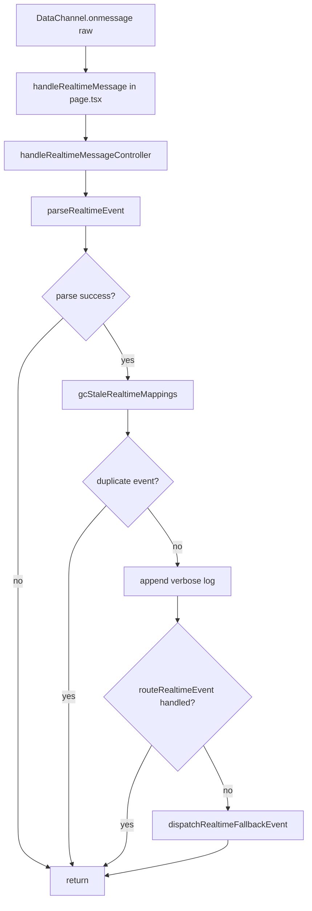
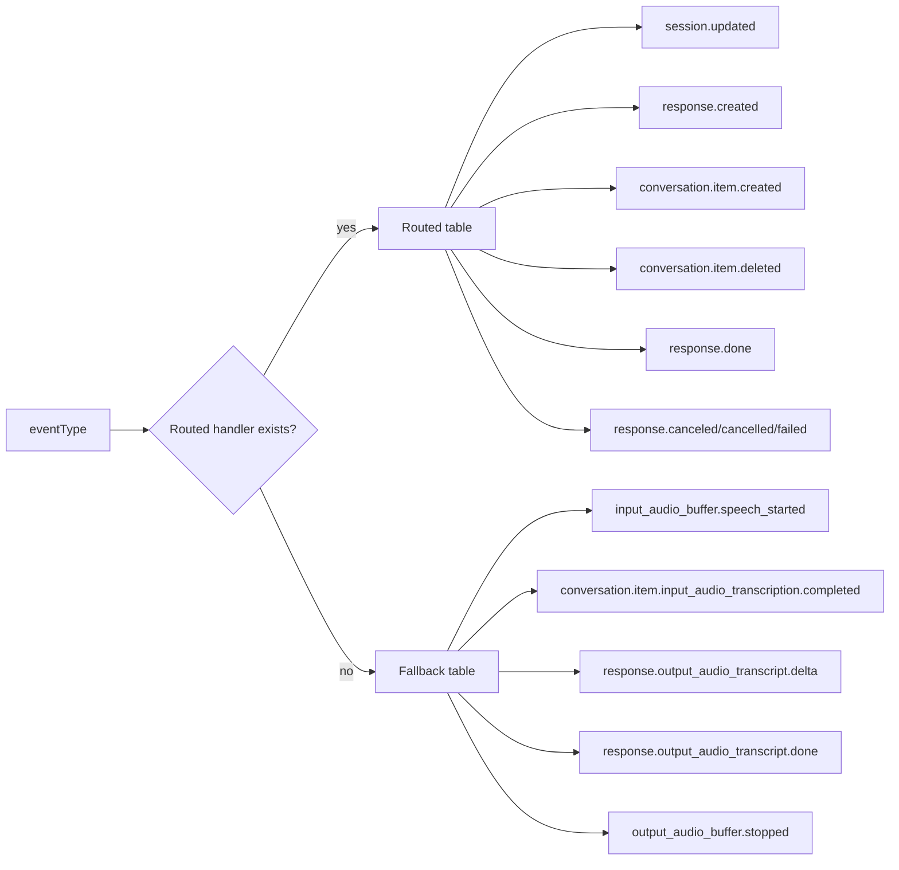
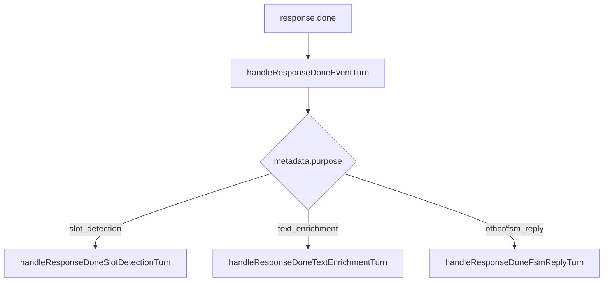

# roleplay-test-v2 이벤트 분기 / 폴더 구조 정리

## 기준 경로

- 페이지 엔트리: `admin/app/(dashboard)/roleplay-test-v2/page.tsx`
- 도메인 모듈: `admin/components/roleplay-test-v2/`

## 폴더 트리 (핵심)

```text
admin/
  app/
    (dashboard)/
      roleplay-test-v2/
        page.tsx

  components/
    roleplay-test-v2/
      context.tsx
      page-state.ts
      types.ts
      realtime-event-utils.ts
      realtime-event-handlers.ts
      page-helpers.ts

      controllers/
        auto-silence-controller.ts
        status-snapshot-controller.ts
        realtime-lifecycle-controller.ts
        realtime-mapping-controller.ts
        realtime-message-controller.ts
        realtime-turn-controller.ts
        session-actions-controller.ts
        roleplay-ops-controller.ts
        section-view-model.ts

      ControlSection.tsx
      RecentSessionStatsSection.tsx
      HintSection.tsx
      PromptTraceSection.tsx
      ManualEventSection.tsx
      MorphAnalysisSection.tsx
      EventLogSection.tsx
      EndConfirmModal.tsx
```

## 이벤트 분기 구조 (실행 흐름)

```text
DataChannel.onmessage(raw)
  -> handleRealtimeMessage (page.tsx)
    -> handleRealtimeMessageController (realtime-message-controller.ts)
      1) parseRealtimeEvent(raw)
      2) gcStaleRealtimeMappings(eventType)
      3) dedupe (event key / TTL)
      4) verbose log (suppressed type 제외)
      5) routeRealtimeEvent(eventType, payload)
         - handled=true 이면 종료
      6) dispatchRealtimeFallbackEvent(eventType, payload)
```

## Routed vs Fallback

### 1) Routed (우선 처리)

정의 파일: `admin/components/roleplay-test-v2/realtime-event-handlers.ts`

- `session.updated` -> 초기 자동 턴 관련 로그/무시
- `response.created` -> responseId <-> purpose 매핑 등록
- `conversation.item.created` -> assistant item 매핑 등록
- `conversation.item.deleted` -> assistant item 매핑 정리
- `response.done` -> `handleResponseDoneEventTurn(...)` 위임
- `response.canceled|cancelled|failed` -> response 매핑 정리

### 2) Fallback (후순위 처리)

정의 파일: `admin/components/roleplay-test-v2/realtime-event-handlers.ts`

- `input_audio_buffer.speech_started` -> speech start 처리
- `conversation.item.input_audio_transcription.completed` -> user transcript 완료 처리
- `response.output_audio_transcript.delta` -> assistant transcript delta 누적
- `response.output_audio_transcript.done` -> assistant transcript done 처리
- `output_audio_buffer.stopped` -> assistant 재생 종료 처리

## response.done 내부 2차 분기

정의 파일: `admin/components/roleplay-test-v2/controllers/realtime-turn-controller.ts`

```text
handleResponseDoneEventTurn(payload)
  -> purpose == slot_detection  -> handleResponseDoneSlotDetectionTurn
  -> purpose == text_enrichment -> handleResponseDoneTextEnrichmentTurn
  -> else                       -> handleResponseDoneFsmReplyTurn
```

## 컨트롤러 책임 맵

- `realtime-message-controller.ts`
  - raw 이벤트 파싱, dedupe, 로그, 라우팅/폴백 진입 제어
- `realtime-event-handlers.ts`
  - 이벤트 타입별 handler table 구성 (routed/fallback)
- `realtime-turn-controller.ts`
  - 턴 단위 도메인 로직 (speech/transcript/response.done 세부 처리)
- `realtime-mapping-controller.ts`
  - event_id-response_id-item_id-purpose 매핑 및 GC
- `session-actions-controller.ts`
  - `sendFsmEvent`, `requestHints`, `warmupHints`, auto hint dedupe
- `realtime-lifecycle-controller.ts`
  - connect/disconnect 및 ref reset
- `auto-silence-controller.ts`
  - 질문 이후 자동 침묵 감지 타이머 규칙
- `status-snapshot-controller.ts`
  - 서버 status snapshot -> UI state 반영
- `roleplay-ops-controller.ts`
  - API 호출군(시나리오, 세션 시작, 통계/분석/저장)
- `section-view-model.ts`
  - UI 섹션용 state/actions 조합

## page.tsx가 현재 하는 역할

- 여러 controller를 조합하는 오케스트레이션 레이어
- React state/ref 생성 및 주입
- UI Section Provider + 렌더 트리 구성

즉, "로직 구현"보다는 "의존성 연결 + 화면 진입점" 성격으로 점차 정리된 상태.

## Mermaid 다이어그램

### 1) Realtime 이벤트 라우팅 흐름



### 2) Routed/Fallback 분기



### 3) response.done 내부 목적 분기


