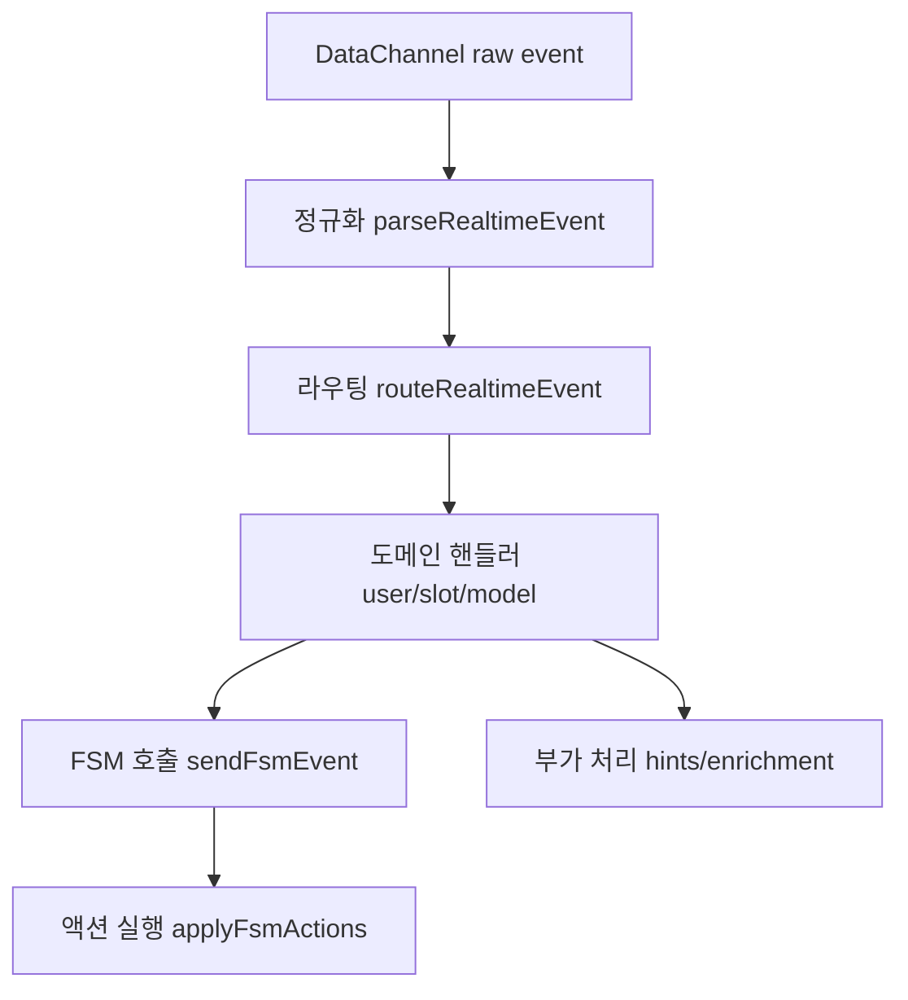
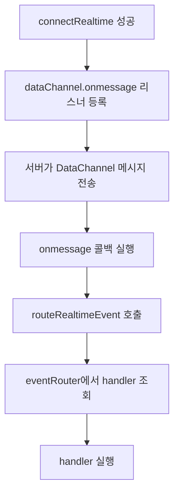

# 이벤트 분기 집중 개선 방향

## 이 문서를 보는 이유
- 지금 문제는 "FSM이 없는 것"이 아니라, **FSM 바깥의 이벤트 해석/분기 코드가 한 곳에 과밀**한 점이다.
- `handleRealtimeMessage`에 이벤트 파싱, 가드, 분기, 후속 호출(FSM/힌트/보강)이 몰려 있어 변경 시 회귀 위험이 높다.

## 현재 상태 한 줄 요약
- FSM은 이미 적용되어 있다: 프론트는 `sendFsmEvent(...)`로 전이를 요청하고, 서버 `actions`를 `applyFsmActions(...)`로 실행한다.
- 병목은 프론트 이벤트 라우팅 계층(`handleRealtimeMessage`)이다.

## 제안 구조


## 코드 상태 비교(간단 예시)

### 현재 코드 상태(분기 집중)
```ts
async function handleRealtimeMessage(raw: string) {
  const payload = JSON.parse(raw);
  const eventType = payload.type;

  if (eventType === "conversation.item.input_audio_transcription.completed") {
    // text 추출 + 가드 + 슬롯판정 + FSM 전이 + 액션실행
  }

  if (eventType === "response.done") {
    // slot_detection/fsm_reply/text_enrichment 목적 분기
  }

  if (eventType === "response.canceled") {
    // responseId/purpose 맵 정리
  }
}
```

### 이후 코드 상태(책임 분리)
```ts
function parseRealtimeEvent(raw: string): NormalizedEvent | null {
  // JSON 파싱 + 최소 필드 정규화
}

const eventRouter: Record<string, (e: NormalizedEvent, ctx: Ctx) => Promise<void>> = {
  "conversation.item.input_audio_transcription.completed": handleInputTranscriptionCompleted,
  "response.done": handleResponseDone,
  "response.canceled": handleResponseCanceled,
};

async function routeRealtimeEvent(raw: string, ctx: Ctx) {
  const event = parseRealtimeEvent(raw);
  if (!event) return;
  const handler = eventRouter[event.type] ?? handleUnknownEvent;
  await handler(event, ctx);
}
```

## 이벤트 등록/동작 시점(핵심 설명)

### 1) 실제 이벤트 리스너 등록은 어디서?
- 리스너 등록은 `connectRealtime`에서 DataChannel이 만들어진 뒤 수행한다.
- 현재 코드 기준으로 `dataChannel.onmessage = (...) => handleRealtimeMessage(event.data)` 형태다.
- 즉, **connectRealtime 성공 전에는 이벤트가 들어와도 처리 함수가 실행되지 않는다.**

### 2) "라우터 등록"은 뭘 의미하나?
- `eventRouter` 객체 선언은 "이벤트 타입 문자열 -> 핸들러 함수" 매핑을 메모리에 올리는 과정이다.
- 예: `"response.done": handleResponseDone`
- 이건 네트워크 리스너 등록이 아니라, 리스너가 받은 이벤트를 어디로 보낼지 정하는 내부 테이블 등록이다.

### 3) 호출은 언제 일어나나?
- 서버가 Realtime DataChannel로 메시지를 보내면 브라우저가 `onmessage` 콜백을 실행한다.
- 콜백에서 `routeRealtimeEvent(raw, ctx)`를 호출하고,
- 라우터가 `event.type`에 맞는 핸들러를 찾아 실행한다.



### 4) 등록 예시(분리 후)
```ts
type EventHandler = (event: NormalizedEvent, ctx: Ctx) => Promise<void>;

const eventRouter: Record<string, EventHandler> = {
  "conversation.item.input_audio_transcription.completed": handleInputTranscriptionCompleted,
  "response.done": handleResponseDone,
  "response.canceled": handleResponseCanceled,
};

function bindRealtimeListeners(dataChannel: RTCDataChannel, ctx: Ctx) {
  dataChannel.onmessage = (event) => {
    if (typeof event.data !== "string") return;
    void routeRealtimeEvent(event.data, ctx);
  };
}
```

## 추가 리스크 섹션
- **상태 원천 다중화**: state/ref/server snapshot이 동시에 존재해 순간 불일치 가능성이 크다.
- **이벤트 순서 역전**: `done/cancel/delete` 순서가 엇갈릴 때 cleanup 타이밍 버그가 발생하기 쉽다.
- **타이머 경합**: watchdog/auto-silence/fallback 타이머가 reconnect 구간에서 stale firing될 수 있다.
- **재시도 정책 단순화**: slot parse retry가 고정 횟수 위주라 네트워크 변동에 둔감하다.
- **idempotency 취약**: 동일 의미 이벤트 재수신 시 FSM 중복 전이 가능성이 있다.

## idempotency 개선 방향(중요)

### 왜 필요한가
- Realtime 환경에서는 같은 의미의 이벤트가 중복 수신될 수 있다.
- 중복 처리되면 `sendFsmEvent`와 `applyFsmActions`가 2번 실행되어 상태 꼬임이 발생한다.

### 어디를 보호해야 하나
- **이벤트 처리**: 같은 이벤트 재수신 시 handler 재실행 방지
- **FSM 전이 호출**: 같은 전이를 1번만 서버로 전송
- **액션 실행**: 같은 action을 1번만 실행
- **맵 정리**: cleanup 함수를 여러 번 호출해도 결과 동일(no-op) 보장

### 구현 방식(쉽게)
1. 이벤트 키를 만든다 (`event_id` 우선, 없으면 대체 키 조합).
2. 최근 처리 키를 `processedEvents`(TTL Map)에 저장한다.
3. 이미 처리된 키면 즉시 return 한다.
4. `sendFsmEvent`에도 `idempotencyKey`를 붙인다.
5. `applyFsmActions`에도 `appliedActionKeys`를 두고 중복 실행을 막는다.

### 간단 예시
```ts
function makeEventKey(event: NormalizedEvent): string {
  if (event.eventId) return event.eventId;
  return [event.type, event.responseId ?? "-", event.itemId ?? "-", event.turnId ?? "-"].join(":");
}

if (processedEvents.has(eventKey)) return; // duplicate skip
processedEvents.set(eventKey, Date.now());
```

```ts
await sendFsmEvent("model.done", payload, {
  idempotencyKey: `model.done:${sessionId}:${responseId}`,
});
```

### 우선 적용 순서
- 1) `sendFsmEvent` idempotencyKey 도입
- 2) `applyFsmActions` 중복 실행 방지
- 3) 이벤트 키 TTL 캐시 도입
- 4) cleanup 멱등 함수 통일

### 완료 체크
- 같은 이벤트 2회 수신 시 실제 부수효과는 1회만 발생
- `done -> canceled` / `canceled -> done` 순서 역전에서도 최종 상태 동일
- 중복 skip 로그(`idempotency skip`)가 확인됨

## 특히 중요한 개선: 맵 정리
- `responsePurposeById`, `activeResponseIdByPurpose`, `latestAssistantItemIdByPurpose`, `assistantItemCreatedAt` 맵 정리가 핵심 병목이다.
- 이 부분은 별도 문서로 분리해 우선 적용한다.
- 상세: [[01_projects/001_malang/flows/41_improvement-specs/004_리얼타임 목적-응답-아이템 맵 정리 개선안|리얼타임 목적-응답-아이템 맵 정리 개선안]]

## 단계별 진행(리스크 낮은 순)
- 1단계: `response.done` 목적별 처리 분리
- 2단계: 전사 가드 pure 함수 분리
- 3단계: 라우터 테이블 전환
- 4단계: 공통 컨텍스트(`ctx`) 명시화
- 5단계: 맵 수명주기 정리(생성/활성/종료/GC)

## 연결 노트
- 함수 맵: [[01_projects/001_malang/flows/30_feature-lanes/005_프론트 시나리오 테스트 함수 맵 v2|프론트 시나리오 테스트 함수 맵(v2)]]
- 개선 인덱스: [[01_projects/001_malang/flows/41_improvement-specs/000_개선 방향 인덱스|개선 방향 인덱스]]
- 실행 체크: [[01_projects/001_malang/flows/41_improvement-specs/006_개선 실행 체크리스트|개선 실행 체크리스트]]
