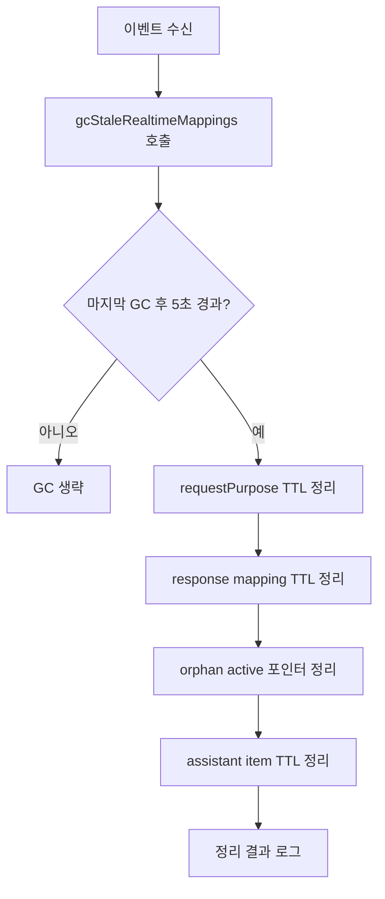

# stale mapping GC 상세 설계

## 목적
- Realtime 이벤트 순서 역전/누락/중복 상황에서 남을 수 있는 stale mapping을 주기적으로 정리해 상태 일관성을 유지한다.

## 비전공자용 한눈에 요약
- 이 기능은 "방 정리"에 가깝다.
- 대화 도중 시스템이 임시 메모(누가 무엇을 말했는지)를 많이 만든다.
- 네트워크 특성 때문에 어떤 메모는 늦게 오거나 중복으로 오고, 어떤 메모는 정리 신호를 못 받고 남는다.
- stale mapping GC는 일정 시간이 지난 "유통기한 지난 메모"를 자동으로 치워서, 다음 동작이 헷갈리지 않게 만든다.
- 즉, 서비스가 오래 돌아도 메모가 쌓여 꼬이지 않게 하는 안전장치다.

## 왜 필요한가
- `response.done`, `response.canceled`, `conversation.item.deleted`가 항상 기대 순서로 오지 않는다.
- cleanup 호출이 누락되거나 늦으면 `activeResponseIdByPurpose` 같은 포인터가 stale 상태로 남는다.
- stale 포인터는 이후 `response.cancel`, item delete 타겟 결정에 오작동을 만든다.

## 정리 대상 맵
- `requestPurposeByEventId`
- `requestPurposeCreatedAtByEventId`
- `responsePurposeById`
- `responseMappingCreatedAtById`
- `activeResponseIdByPurpose`
- `latestAssistantItemIdByPurpose`
- `assistantItemCreatedAt`

## 현재 적용 파라미터
- `REQUEST_PURPOSE_STALE_MS = 2 * 60 * 1000`
- `ASSISTANT_ITEM_MAPPING_STALE_MS = 2 * 60 * 1000`
- `RESPONSE_MAPPING_STALE_MS = 10 * 60 * 1000`
- `MAPPING_GC_INTERVAL_MS = 5000`

## 동작 방식
1. 이벤트를 처리할 때 `gcStaleRealtimeMappings(reason)`를 먼저 호출한다.
2. 마지막 GC 시점(`lastMappingGcAtRef`) 기준으로 너무 자주 실행되지 않게 throttle한다.
3. 각 맵에서 TTL을 넘긴 엔트리를 삭제한다.
4. `response`/`item` 관련 항목은 공통 cleanup 함수를 통해 멱등 정리한다.
5. orphan active 포인터(`responsePurposeById`에 없는 responseId)도 정리한다.
6. 정리 건수가 있으면 verbose 로그로 요약 출력한다.

## 처리 흐름

## 멱등성 원칙
- `cleanupResponseMapping(responseId, reason)`는 여러 번 호출돼도 동일 결과를 보장한다.
- `cleanupAssistantItemMapping(itemId, reason)`도 이미 지워진 상태에서 no-op로 안전하다.
- GC는 직접 맵을 부분 삭제하기보다 가능한 공통 cleanup을 우선 호출한다.

## 로그 규약
- 정리 발생 시 로그 예시:
  - `[GUARD] stale mapping gc reason=event:response.done requestPurpose=1 response=0 active=1 item=2`
- 이 로그로 다음을 확인할 수 있다.
  - 어떤 이벤트 계열에서 stale이 많이 발생하는지
  - response/item 중 어느 맵 누수가 큰지

## 튜닝 기준
- `REQUEST_PURPOSE_STALE_MS`
  - 너무 짧으면 정상 지연 이벤트도 조기 삭제
  - 너무 길면 요청-응답 매핑 누수 시간 증가
- `RESPONSE_MAPPING_STALE_MS`
  - 세션 길이/응답 지연 분포 기준으로 조정
  - 긴 통화/지연 응답이 많은 환경이면 증가 필요
- `MAPPING_GC_INTERVAL_MS`
  - 너무 짧으면 이벤트당 CPU/Map 순회 비용 증가
  - 너무 길면 stale 정리 지연

## 실패/주의 케이스
- GC가 response mapping을 먼저 지웠는데 늦게 `response.done`이 들어오면 cleanup 로그만 남고 no-op 처리된다(의도된 동작).
- `assistantItemCreatedAt`만 있고 `latestAssistantItemIdByPurpose`가 없는 orphan 케이스도 item 기준 cleanup으로 정리된다.
- `activeResponseIdByPurpose`는 response map을 신뢰하고 orphan 제거를 수행하므로, response map 누락이 있으면 active만 남지 않게 보정된다.

## 검증 시나리오
- 같은 responseId에 대해 `canceled -> done` 순서로 수신
- `item.deleted` 선행 후 `response.done` 도착
- response.created 후 done/canceled 누락(시간 경과로 GC 정리)
- 빠른 이벤트 폭주 시 GC throttle(5초) 동작 확인

## 운영 체크 포인트
- 세션 종료 시 맵 clear와 GC 상태(`lastMappingGcAtRef`) 초기화 여부
- `stale mapping gc` 로그 빈도/건수 모니터링
- 장시간 세션에서 맵 크기 증가 추세가 없는지 점검

## 연결 노트
- [[01_projects/001_malang/flows/41_improvement-specs/004_리얼타임 목적-응답-아이템 맵 정리 개선안|리얼타임 목적-응답-아이템 맵 정리 개선안]]
- [[01_projects/001_malang/flows/41_improvement-specs/005_맵 정리 공통화|맵 정리 공통화]]
- [[01_projects/001_malang/flows/41_improvement-specs/006_개선 실행 체크리스트|개선 실행 체크리스트]]
- [[01_projects/001_malang/flows/41_improvement-specs/007_idempotency 적용 및 맵 정리 공통화|idempotency 적용 및 맵 정리 공통화]]
