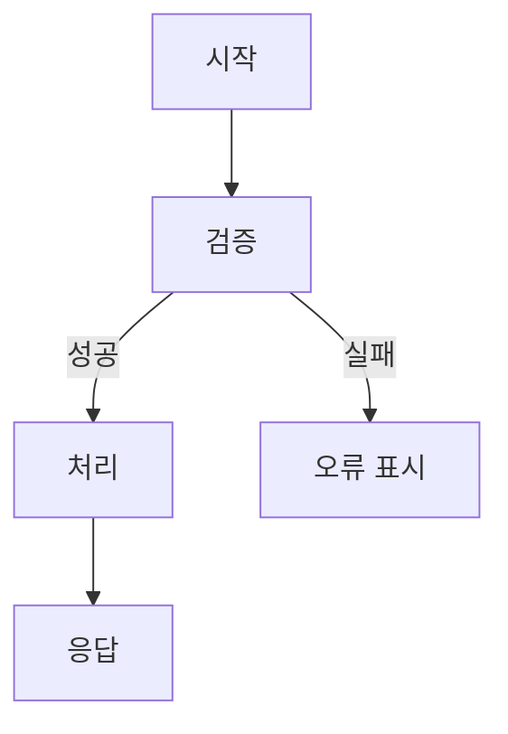

# {{title}}

## 목적
- 

## 진입 조건
- 

## 메인 플로우

```mermaid
flowchart TD
  A["시작"] --> B["검증"]
  B -->|성공| C["처리"]
  B -->|실패| D["오류 표시"]
  C --> E["응답"]
```

## Mermaid 체크
- 노드 라벨은 항상 `["]` 형식 사용
- `()`, `/`, `->`, `.`, `=` 포함 라벨도 문자열로 감싸기

## 예외 분기
- 

## 연결 노트
- 프로젝트:
- 이슈:
- API:
